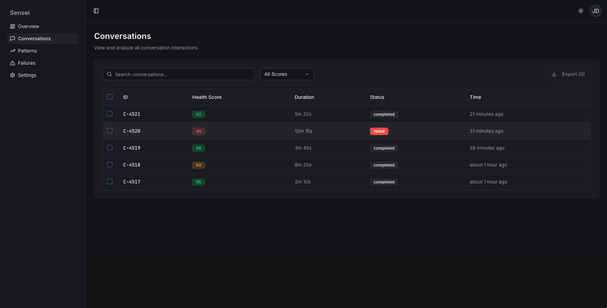

# Sensei

A lightweight analytics platform for AI conversations. It scores conversation health, detects failures, and surfaces usage patterns. Single‑admin MVP powered by Supabase + Express + Drizzle.

## Overview

- **Core:** SDK + REST API + Dashboard
- **Backend:** Node.js/Express, Supabase (Postgres), Drizzle ORM
- **Frontend:** React + Vite + Tailwind
- **Auth:** Supabase Auth (Bearer JWT) for dashboard; API keys for ingestion

## Quick Start
- **Prereqs:** Node 18+, npm, a Supabase project (Postgres URL), optional Redis if using workers later.
- **Setup:**
  - `cp .env.example .env` and fill values:
    - `DATABASE_URL` (Postgres with `?sslmode=require` on Supabase)
    - `SUPABASE_URL`, `SUPABASE_ANON_KEY`, `SUPABASE_SERVICE_ROLE_KEY`
    - `SUPABASE_JWT_SECRET` (optional in dev; if omitted, dashboard routes allow requests for local testing)
    - `INGEST_API_KEY` (for ingestion endpoint tests)
  - Initialize DB: `npm run db:up`
- **Run (dev):** `npm run dev` → API and client on `http://localhost:3000`

## How To Test (cURL & Postman)
- **Auth behavior:**
  - Dev with no `SUPABASE_JWT_SECRET`: dashboard/read endpoints accept requests without a token.
  - With `SUPABASE_JWT_SECRET`: add `Authorization: Bearer <supabase_access_token>` to all `/api/v1/*` dashboard calls.
  - Ingestion: always send `x-api-key: ${INGEST_API_KEY}`.

- **cURL examples (read APIs):**
  - Health: `curl http://localhost:3000/health`
  - DB Health: `curl http://localhost:3000/api/v1/health/db`
  - Conversations (paged/filtered):
    - `curl "http://localhost:3000/api/v1/conversations?page=1&page_size=20&health_min=50&has_failures=true"`
  - Messages for a conversation:
    - `curl http://localhost:3000/api/v1/conversations/<id>/messages`
  - Health breakdown:
    - `curl http://localhost:3000/api/v1/conversations/<id>/health`
  - Failures for a conversation:
    - `curl http://localhost:3000/api/v1/conversations/<id>/failures`
  - Analytics summary:
    - `curl "http://localhost:3000/api/v1/analytics/summary?timeframe=7d"`
  - Failure trends (last 7 days by default):
    - `curl "http://localhost:3000/api/v1/analytics/failures/trends"`

- **Postman setup:**
  - Create an Environment with `baseUrl=http://localhost:3000`.
  - If `SUPABASE_JWT_SECRET` is set, add a default `Authorization` header: `Bearer {{accessToken}}` and paste a valid Supabase access token as `accessToken`.
  - Create requests:
    - `GET {{baseUrl}}/api/v1/conversations?page=1&page_size=20`
    - `GET {{baseUrl}}/api/v1/conversations/:id/messages`
    - `GET {{baseUrl}}/api/v1/conversations/:id/health`
    - `GET {{baseUrl}}/api/v1/conversations/:id/failures`
    - `GET {{baseUrl}}/api/v1/analytics/summary?timeframe=7d`
    - `GET {{baseUrl}}/api/v1/analytics/failures/trends`
  - Ingestion test (optional): set header `x-api-key: {{ingestKey}}` for `POST {{baseUrl}}/api/v1/conversations/track`.

## API Reference (Read, MVP)
- `GET /api/v1/conversations`
  - Filters: `from`, `to` (ISO), `health_min`, `health_max`, `has_failures` (true/false), `pattern_id` (uuid)
  - Pagination: `page`, `page_size` (max 200)
  - Returns paginated items with `id`, `external_id`, `health_score`, `status`, `updated_at`, `duration_seconds`.
- `GET /api/v1/conversations/:id/messages` → ordered messages with sentiment
- `GET /api/v1/conversations/:id/health` → `{ score, breakdown }`
- `GET /api/v1/conversations/:id/failures` → failures linked to conversation
- `GET /api/v1/analytics/summary?timeframe=24h|7d|30d` → KPIs + 7‑day volume trend
- `GET /api/v1/analytics/failures/trends?from=&to=&bucket=day` → per‑type daily series

## Project Structure
- `server/` – Express API, routes, middleware, db client
- `shared/` – Drizzle schema and shared types
- `client/` – React dashboard (Vite)

## NPM Scripts
- `npm run dev` – run API + Vite in development
- `npm run build` – build client and API bundle
- `npm run start` – start production server from `dist/`
- `npm run db:up` – set up DB (extensions + push schema)
- `npm run db:generate` – generate SQL migrations

## Deployment
- Ensure env vars are set (see `.env.example`).
- Build and run: `npm run build && npm run start`.
- Secure TLS (remove any local `NODE_TLS_REJECT_UNAUTHORIZED=0`).

## Screenshots
### Conversations

### Failures

### Patterns

